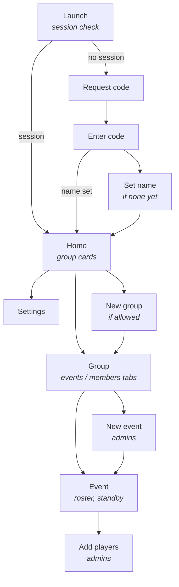

# Muster — Screens

CONTEXT.md holds the product decisions, SCHEMA.md the database, and
`design/DESIGN.md` the visual design. This file covers what the app
looks like and how you move through it.

Where this file and DESIGN.md disagree on visual detail, DESIGN.md wins
— it was written against the finished frames.

## Map

Nine screens. A plain stack — no bottom navigation.

## Staying current

There is no live sync. Data is fetched when a screen needs it, and there
are two ways to get fresh data after that:

- **Refresh on resume** — refetch when the screen returns to the
  foreground, or is returned to from further up the stack.
- **Pull to refresh** — manual, for when someone is watching and waiting.
  **Android and iOS only.** On desktop web there is no pull gesture, and
  on mobile web it fights the browser's own pull-to-refresh, which
  reloads the page. Web has refresh-on-resume and nothing else; if a
  manual refresh is wanted there it needs an explicit button.

Both apply to Home, the Group events tab, the Group members tab, and
Event. Not to Launch, Request code, Enter code, Set name or Settings:
nothing changes underneath those.

Event is the one that matters most. Standby promotion happens in a
database trigger, so no client code runs when a player is promoted —
without a refresh they learn about it the next time they open the screen.
Until push lands, that is the only notification there is.

## Screens

### Launch
Not a screen, a routing decision. Session? Then Home. No session? Then
Request code. Session but `profiles.name` is null? Then Set name, which
cannot be skipped.

### Request code / Enter code
Email in, six-digit code back, code in. No passwords anywhere. See
CONTEXT.md → "Email codes, no passwords".

### Set name
Shown when `profiles.name` is null. Same screen as the name field in
Settings — build once, use twice.

### Home
Cards, one per group.

- A group you belong to: name, tap to open.
- A group you have been invited to: name, who invited you, plus Accept
  and Decline on the card. No separate invitations screen — before
  accepting you belong to nothing, so there is nowhere else for them to
  live.

The inviter's name needs its own `security definer` RPC
(`get_my_pending_invitations`): an invitee shares no group with the
inviter yet, so `profiles_select` will not show them that profile.

App bar has Settings. New group only if `can_create_groups` is true.

### Settings
Leaf screen off Home.

- Name — editable. The only profile column the grants allow. Save is
  disabled until the name actually differs from the stored one, so there
  is no pointless round trip, and a brief "Saved" confirms it afterwards
  — without it a successful save and a no-op look identical, since the
  field already shows what you typed.
- Leaving with unsaved edits prompts before discarding them.
- Email — read-only. There is no change-email path by design.
- Sign out. Sessions never expire, so this is the only way back to
  sign-in.

Later: notification preferences once push lands.

### Group
Two tabs. Tabs rather than bottom navigation — bottom nav is for
app-level roots you switch between, and Group sits a level down the
stack.

**Events tab** — upcoming events only. Past events are out of scope for
now; a second tab is the obvious home for them later. New event button
for admins.

**Members tab** — one list, everyone in it, with a status against each
name: admin, member, or pending.

- Pending rows show an **email address, not a name**. The invitee has no
  profile the group can read, so there is no name to show. Do not design
  the row assuming one exists.
- Pending rows are **shown to admins only**. An address a member cannot
  resolve to a person is clutter, not a secret — so this is a display
  choice in the app, not a policy change. `group_invitations_select`
  stays as it is.
- Admins: add by email (top of the tab), promote, demote, remove.
- Anyone: leave the group.
- Archiving the group lives in the Group app bar overflow, admins only,
  above Leave group.

### New event
Own screen. Title, start time, location, capacity. Capacity cannot be
changed afterwards. Lands on the new event.

### Event
Details on top, then the roster, then the standby queue.

Everyone sees the whole roster and each player's RSVP. Players can
change only their own. Admins can change anyone's, reorder the queue,
and add players.

The roster is one list sorted in, then pending, then out — not grouped
into sections.

Once `starts_at` passes the event freezes: every control disappears and
the screen reads the same for admins and members. DESIGN.md frame 1n has
the detail.

### Add players
Member picker. Group members not already on the event, multi-select,
confirm.

The admin does not choose between inviting and benching. The app invites
while slots remain and queues the rest; the database promotes
automatically as slots free up. There is deliberately no "add to
standby" action — with a slot free, the trigger would promote them
instantly and the queue would flash empty.

Reordering is separate: `set_standby_order` takes the whole queue, so it
is a drag-to-reorder list on the Event screen, not part of adding.

## Open questions

The four that lived here — where archiving lives, roster grouping, the
frozen event, and Home's empty state — are all settled in DESIGN.md.

Still open:

- A past events tab. Out of scope for now.
- Notification preferences in Settings, once push lands.
- **Supabase Realtime.** `realtime-kt` would push Postgres changes over
  a websocket, so a promoted standby player, or an RSVP someone else
  changed, would appear without a refresh. The natural fit is Event, the
  one screen several people look at simultaneously in the hour before a
  match. Deferred: refresh-on-resume covers almost everything, and
  Realtime adds a module to verify on wasm, connection lifecycle across
  four platforms, and subscriptions that RLS can silently filter to
  nothing. Revisit once Event exists.
